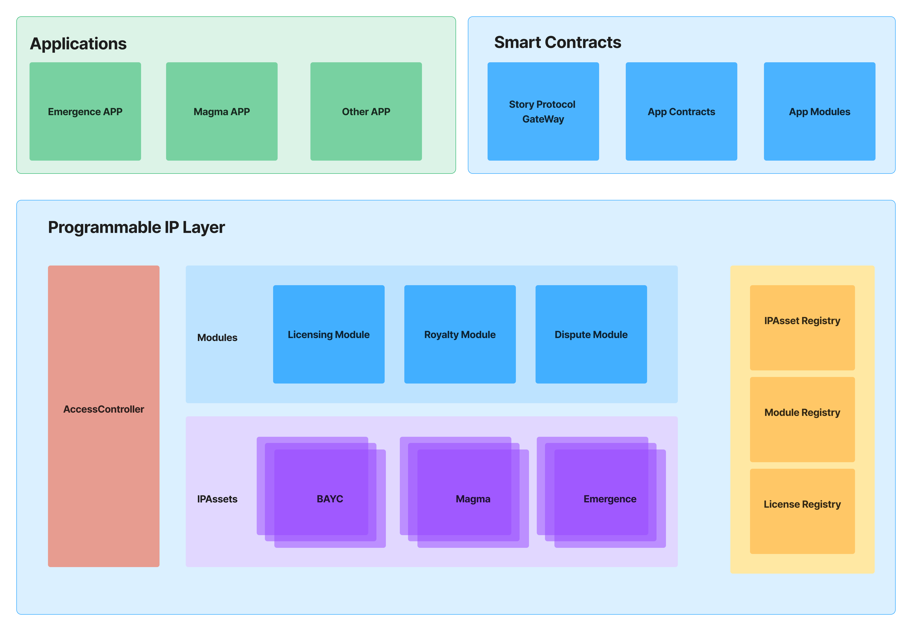

# Story Protocol Beta

Story Protocol is building the Programmable IP layer to bring programmability to IP. Story Protocol transforms IPs into networks that transcend mediums and platforms, unleashing global creativity and liquidity. Instead of static JPEGs that lack interactivity and composability with other assets, programmable IPs are dynamic and extensible: built to be built upon. Creators and applications can register their IP with Story Protocol, converting their static IP into programmable IP by declaring a set of onchain rights that any program can read and write on.

# Documentation

🚧 WARNING, Beta version: This code is in active development and unaudited. Do not use in Production 🚧

[Learn more about Story Protocol](https://docs.storyprotocol.xyz/)

Story Protocol merges the concepts of IP identity and functionality, paving the way for innovative and dynamic IP management on public, permissionless blockchain.

# Architecture Overview

## Architecture Diagram


Let's briefly introduce the layers mentioned in the above diagram:

## Core Concepts

### IPAsset (Nouns)

IPAssets are the foundational programmable IP metadata on Story Protocol. Each IPAsset represents an onchain NFT (representing an IP) and its associated IPAccount, which is a modified ERC-6551 (Token Bound Account) implementation. An IPAsset transforms a new or existing NFT like BAYC into a versatile and interactive IP entity.

### IPAccount

IPAccounts are onchain programmable IPs that represent respective NFTs, implemented with Story Protocol's modification to ERC-6551. For example, a Mad Lad NFT will have an associated IPAccount, whose owner is the owner of that Mad Lad NFT.

All interactions within Story Protocol center around IPAccounts, with the protocol's focus on enabling the IPAccount-centric system. Licensing, revenue/royalty sharing, remixing, and other critical features are made possible due to the IPAccount's programmability.

A key feature of IPAccount is the generic execute() function, which allows calling arbitrary modules within Story Protocol via encoded bytes data (thus extensible for future modules). Additionally, there is executeWithSig() function that enables users to sign transactions and have others execute on their behalf for seamless UX.

### Module (Verb)

Modules are customizable programs (smart contracts) that define and extend the functionality of IPAccounts in Story Protocol. As "Verbs" act on "Nouns" (IPAccount), modules empower developers to create functions and interactions for each IP to make IPs truly programmable.

### Registry

A "Registry" functions as a primary directory/storage for the global states of Story Protocol. Unlike IPAccounts, which manage the state of specific IPs, a Registry oversees the broader states of the protocol.

### Access Controller

Access Controller manages all permission-related states and permission checks in Story Protocol. In particular, it maintains the Permission Table and Permission Engine to process and store permissions for calls between modules and from IPAccounts.

### Application Layer (Ecosystem)

This layer comprises applications that build on top of Story Protocol for IP business, such as distribution, discovery, and co-creation.

# Deployed Contracts
- [Sepolia addresses](https://docs.storyprotocol.xyz/docs/deployed-smart-contracts-1)

# Interacting with Codebase

## Requirements

Please install the following:

- [Foundry / Foundryup](https://github.com/gakonst/foundry)
- [Hardhat](https://hardhat.org/hardhat-runner/docs/getting-started#overview)

And you probably already have `make` installed... but if not [try looking here.](https://askubuntu.com/questions/161104/how-do-i-install-make) and [here for MacOS](https://stackoverflow.com/questions/1469994/using-make-on-os-x)

## Quickstart

```sh
yarn # this installs packages
make # this builds
```

## Testing

```
make test
```

## Coverage

```
make coverage
```
Open `index.html` in `coverage/` folder.

# Deploying to a network

## Setup

You'll need to add the following variables to a `.env` file:

-   `MAINNET_URL`
-   `MAINNET_PRIVATEKEY`
-   `SEPOLIA_URL`
-   `SEPOLIA_PRIVATEKEY`
-   `ETHERSCAN_API_KEY`

## Deploying

```
make deploy-sepolia
```

### Working with a local network

Foundry comes with local network [anvil](https://book.getfoundry.sh/anvil/index.html) baked in, and allows us to deploy to our local network for quick testing locally.

To start a local network run:

```
make anvil
```

This will spin up a local blockchain with a determined private key, so you can use the same private key each time.

# Code Style
We employed solhint to check code style.
To check code style with solhint run:
```
make lint
```
To re-format code with prettier run:
```
make format
```

## Guidelines

[See our contribution guidelines](./GUIDELINES.md)

# Security

We use slither, a popular security framework from [Trail of Bits](https://www.trailofbits.com/). To use slither, you'll first need to [install python](https://www.python.org/downloads/) and [install slither](https://github.com/crytic/slither#how-to-install).

Then, you can run:

```
make slither
```

And get your slither output.

# Licensing

The license for Story Protocol Core is the Business Source License 1.1 (BUSL-1.1), see LICENSE.

In the terms of service with your End Users, governing your End Users’ use of and access to your App, you will include the following sentence:

“This application is integrated with functionality provided by Story Protocol, Inc. that enables intellectual property registration and tracking. You acknowledge and agree that such functionality and your use of this application is subject to Story Protocol, Inc.’s End User Terms."


# Document Generation

We use [solidity-docgen](https://github.com/OpenZeppelin/solidity-docgen) to generate the documents for smart contracts. Documents can be generated with the following command:

```
npx hardhat docgen
```

By default, the documents are generated in Markdown format in the `doc` folder of the project. Each Solidity file (`*.sol`) has its own Markdown (`*.md`) file. To update the configuration for document generation, you can update the following section in `harhat.config.js`:

```
docgen: {
  outputDir: "./docs",
  pages: "files"
}
```

You can refer to the [config.ts](https://github.com/OpenZeppelin/solidity-docgen/blob/master/src/config.ts) of solidity-docgen for the full list of configurable parameters.